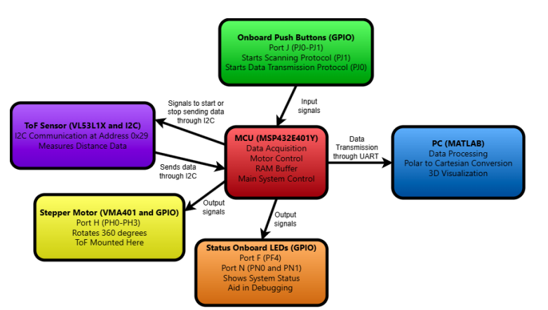
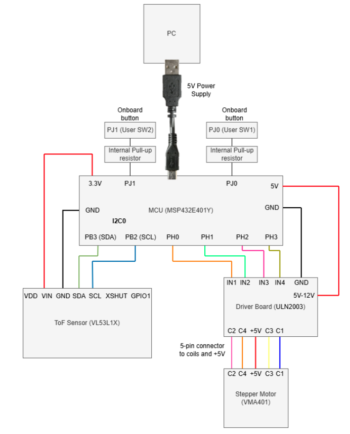

<div align="center">

# RadialSense

### A ToF-Based 3D Spatial Mapping Device

**Low-cost embedded LiDAR that reconstructs indoor spaces in 3D for roughly $120**

<br>


</div>

---

## Table of Contents

| Section | Description |
|---|---|
| [Overview](#overview) | What the device is and what it does |
| [Features](#features) | Bus speed, voltage, cost, memory and communication |
| [System Architecture](#system-architecture) | Block diagram and data flow |
| [Device Characteristics](#device-characteristics) | Full specification table |
| [Cost Breakdown](#cost-breakdown) | Bill of materials |
| [How It Works](#how-it-works) | Acquisition, processing, conversion, displacement |
| [Wiring and Circuit Schematic](#wiring-and-circuit-schematic) | Pin-to-pin connections |
| [Getting Started](#getting-started) | Setup and usage instructions |
| [Status LEDs](#status-leds-and-debugging) | LED definitions for debugging |
| [Coordinate System](#coordinate-system) | How the 3D space is defined |
| [Results](#results) | Application example |
| [Engineering Analysis](#engineering-analysis) | Clock config, limitations, bottlenecks |
| [Repository Structure](#repository-structure) | Where everything lives |

---

## Overview

The system is a spatial mapping device that acquires distance measurements using a time-of-flight sensor, processes the data on a microcontroller, and transmits it to a PC for 3D visualization through MATLAB.

Distance measurement is performed using the VL53L1X ToF sensor, which handles signal acquisition and preprocessing internally. It works by emitting a laser pulse and measuring the time taken from the reflected signal to return back to the sensor using the formula:

```
                    photon travel time
Measured distance = ------------------ x speed of light
                            2
```

This allows direct digital distance measurements without requiring analog signal conditioning or analog-to-digital conversion, as the sensor already has these steps integrated within the hardware. This means that the sensor provides the MCU with ready-to-go digital data.

The microcontroller communicates with the ToF sensor using the I2C protocol to retrieve distance measurements. The sensor is mounted on a stepper motor, which rotates 360 degrees, allowing measurements to be taken at fixed angular intervals of 11.25 degrees. Multiple scans are collected at different x-axis positions to construct a 3D spatial map.

After data acquisition, the microcontroller stores measurements in memory and transmits them to a PC using UART communication at 115200 baud. The format of the data transmitted is 8 data bits, no parity bit, and 1 stop bit. This UART signal is converted to USB via an onboard interface and received by MATLAB through a virtual COM port.

On the PC side, MATLAB processes the transmitted data and converts polar measurements into Cartesian coordinates using trigonometry. The x-coordinates are auto-fixed and are displaced 100 mm per scan in the MATLAB code starting from the origin. The processed data is then visualized using a 3D plot, performing 3D mapping of the scanned environment.

---

## Features

| Feature | Value | Description |
|---|---|---|
| **Bus Speed** | 34 MHz | The microcontroller operates at a system clock of 34 MHz. The clock controls timing for sensor polling and motor stepping. |
| **Operating Voltage** | USB Input 5V<br>MCU logic 3.3V<br>ToF Sensor 3.3V (2.6V to 3.5V permitted)<br>Stepper Motor 5V (5V to 12V permitted) | The microcontroller is powered via a 5V supply through a micro-USB connection. An onboard voltage regulator converts this to 3.3V, which is used for the system's logic and GPIO operation. The VL53L1X requires at least a 2.8V supply and is powered with a 3.3V supply by the microcontroller. The stepper motor is powered at 5V from the microcontroller through the ULN2003 driver board. |
| **Cost** | ~$120 total | The estimated total system cost is significantly lower than commercial LiDAR and 3D mapping systems which typically cost hundreds to thousands of dollars. This system has an estimated cost of $120 demonstrating the feasibility of a low-cost spatial mapping solution. |
| **Serial Communication** | 115200 baud, 8-N-1 | UART is used to transmit buffered scan data from the microcontroller to the PC. A baud rate of 115200 was used to provide reliable high-speed communication for transferring multiple scans. The data format used for UART transmission was 8 data bits, no parity bit, and 1 stop bit, standard for UART communication. |
| **Programming Language** | MCU in C<br>Receiver in MATLAB | MATLAB is used on the PC side to receive, parse, and visualize transmitted data through 3D reconstruction from the microcontroller system. The firmware on the microcontroller uses the language C. |
| **Memory Information** | RAM buffer ~1280 bytes<br>Flash 1024 KB<br>SRAM 256 KB | Scan data is stored in a 2D array on the microcontroller before transmission to the receiver. With 20 scans, 32 measurements each, and 2 bytes per value, the total memory usage is approximately 1280 bytes. Since the scan buffer uses 1280 bytes out of 256 KB from the SRAM, memory is not a constraint for this system. The MCU's flash stores the program code and SRAM holds runtime variables like the scan buffer. |

---

## System Architecture

Below is a block diagram showing the data flow through the system including the onboard push buttons for scan and data transmission control, I2C communication between the MCU and ToF, GPIO-driven stepper motor control, status LED control, and the UART transmission path to the PC where MATLAB performs 3D visualization.

<div align="center">



</div>

```
   [ ToF Sensor ]  <--- I2C @ 0x29 --->  [ MSP432E401Y ]  --- UART 115200 --->  [ PC / MATLAB ]
   VL53L1X                                  34 MHz                               Polar to Cartesian
   940 nm laser                             RAM buffer                           3D plot3 render
        |                                       |
        | mounted on                            | GPIO PH0-PH3
        v                                       v
   [ Stepper Motor VMA401 ]  <-------  [ ULN2003 Driver Board ]
   512 steps per revolution
```

---

## Device Characteristics

| Characteristic | Value | Description |
|---|---|---|
| **Microcontroller** | MSP432E401Y | Main processing unit responsible for motor control, data acquisition, and communication. |
| **ToF Sensor** | VL53L1X | Laser-based time-of-flight sensor used to measure distance by emitting an infrared pulse and calculating the time taken for the reflection to return. |
| **Stepper Motor** | VMA401 and ULN2003 | 5V stepper motor with ULN2003 driver used to rotate the ToF sensor for 360 degree scanning at angular intervals. |
| **System Clock (Bus Speed)** | 34 MHz | System clock frequency used for timing operations and peripheral control. |
| **Operating Voltage (MCU Logic)** | 3.3V | Microcontroller operates at 3.3V logic level via onboard voltage regulation. |
| **Power Input** | 5V (USB) | System is powered through a micro-USB connection providing 5V input. |
| **ToF Sensor Interface** | I2C at 28.3 kHz | Communication between MCU and VL53L1X sensor using I2C protocol. |
| **Serial Communication** | UART at 115200 baud | Data transmission from MCU to PC via UART over USB virtual COM port. |
| **Measurement Resolution** | 32 points per scan | Each full rotation produces 32 distance measurements with 11.25 degree spacing. |
| **Maximum Scans Stored** | 20 scans | Limited by onboard RAM buffer before transmission. |
| **Stepper Motor Control** | GPIO Port H, pins PH0 to PH3 | Motor driven using 4 GPIO pins for phase sequencing. |
| **Push Button Inputs** | GPIO Port J, pins PJ0 to PJ1 | Two onboard buttons used for scan trigger and data transmission control. |
| **Status Indicators** | GPIO Port F and Port N, pins PF4, PN0, PN1 | LEDs used for measurement indication, UART transmission, and system status. |

---

## Cost Breakdown

| Component | Cost |
|---|---|
| MSP432E401Y Microcontroller | ~$70 |
| VL53L1X ToF Sensor | ~$20 |
| VMA401 Stepper Motor with ULN2003 Driver | ~$15 |
| Miscellaneous (wires, etc) | ~$15 |
| **Total Estimated System Cost** | **~$120** |

The estimated total system cost is significantly lower than commercial LiDAR and 3D mapping systems which typically cost hundreds to thousands of dollars, demonstrating the feasibility of a low-cost spatial mapping solution.

---

## How It Works

### Acquisition

Distance measurements are obtained using the VL53L1X time-of-flight sensor. The sensor operates by emitting a 940 nm infrared laser pulse and measuring the time taken for the reflected signal to return from a target. Using the speed of light, the sensor internally calculates the distance and outputs a digital value in millimeters.

The VL53L1X already integrates signal acquisition, preprocessing, and computation internally, so there was no need for additional analog signal conditioning or ADC conversion, resulting in easy data acquisition. The microcontroller communicates with the sensor using the I2C protocol, configured at 28.3 kHz, where the microcontroller acts as the leader and the sensor as the follower device.

Distance measurements are read from the sensor through I2C registers after each measurement cycle. A measurement cycle involves ranging, getting data, clearing interrupts, and checking if the measurement is valid. The sensor is mounted on a stepper motor, and a total of 32 measurements are taken per 360 degree rotation. The 32 measurements are spaced at angular intervals of 11.25 degrees which were determined by the motor step configuration.

### Data Processing

The raw distance measurements obtained from the ToF sensor are processed on the PC side using MATLAB, after the microcontroller transmits distance values along with the scan index through UART. No coordinate transformation is performed on the microcontroller as the microcontroller is solely responsible for acquiring and transmitting data in the system.

Each measurement taken in a scan corresponds to a specific angle which is determined based on the measurement index within a scan:

```
angle = measurement index x 11.25 degrees
```

Using this angle and the measured distance, the data is converted from polar coordinates to Cartesian coordinates in the y-z plane. The x-coordinate is determined by the displacement of the sensor between scans.

### Conversion Formula

The conversion from polar to Cartesian coordinates is performed using the following equations, where r is the measured distance in millimeters and theta is the angle of measurement in degrees:

```
y = r cos(theta)
z = r sin(theta)
```

**Example calculation** for a measurement where r = 1000 mm and theta = 45 degrees:

```
y = 1000 x cos(45) = 707 mm
z = 1000 x sin(45) = 707 mm

If the displacement for that scan is x = 200 mm, the final 3D
coordinate becomes (x, y, z) = (200, 707, 707) in Cartesian coordinates
```

### Displacement

Displacement refers to the movement of the sensor along the x-axis between consecutive scans which allows the system to capture 3D spatial data rather than just slices. In this system, displacement is manually implemented by moving the system between scans. In the MATLAB code, a fixed displacement of 100 mm is used between each scan:

```
displacement / x = scan index x 100 mm
```

This value is used as the x-coordinate during 3D mapping, while the y and z coordinates are derived from the distance and angle measurements after the conversion formulas have been applied. By combining the various scans taken at different x positions, the system is able to properly render a 3D representation of the environment.

### Visualization

Visualization of the spatial data is performed using MATLAB. The microcontroller transmits scan data over a serial connection which MATLAB receives using the `serialport()` function. Incoming data is read line-by-line using the `readline()` function, with each value separated by a line feed terminator.

The data is then parsed and stored in an array containing x, y, and z coordinates after conversion formulas are applied to store Cartesian coordinates. The 3D spatial map is then generated using the `plot3()` function, where each scan is displayed as a connected set of points and different scans are assigned distinct colors using the `lines()` colormap for clarity. Features such as grid on, axis labeling, and `rotate3d` are used in the MATLAB code to improve visualization and allow interactive exploration of the 3D map.

### Serial Data Protocol

The firmware transmits buffered scan data in a plain-text framed format that MATLAB parses directly:

```
BEGIN_DATA
SCAN 0 0                <- scan index and x displacement in mm
1204                    <- 32 distance values, one per line
1187
...
SCAN 1 100
...
END_DATA
```

---

## Wiring and Circuit Schematic

Below is the circuit schematic for the system showing all the pin-to-pin connections from the microcontroller to the external peripherals. The 5-pin connector from the stepper motor can be seen connecting to the driver board and the onboard buttons can be seen with the internal pull-up resistors. Note that those onboard buttons did not need wiring but were merely included in the circuit schematic for illustrative purposes. The 5V power supply from the PC and ToF sensor wiring can also be seen.

<div align="center">



</div>

### Pin Assignment Reference

| MCU Pin | Connects To | Function |
|---|---|---|
| **PB2** | ToF Sensor SCL | I2C0 clock line |
| **PB3** | ToF Sensor SDA | I2C0 data line |
| **PG0** | ToF Sensor XSHUT | Hardware reset for the sensor |
| **PH0 to PH3** | ULN2003 IN1 to IN4 | Stepper motor phase sequencing |
| **PJ1** | Onboard button (User SW2) | Trigger a full 360 degree scan |
| **PJ0** | Onboard button (User SW1) | Stop scanning and transmit data |
| **PF4** | Onboard LED D3 | Blinks on each distance measurement |
| **PN1** | Onboard LED D1 | Blinks on each UART transmission |
| **PN0** | Onboard LED D2 | On while motor unwinds to home |
| **PF2** | Test point | Clock output for bus speed verification |
| **3.3V** | ToF Sensor VIN | Sensor supply |
| **5V** | ULN2003 driver board | Motor supply |
| **GND** | All peripherals | Common ground |

---

## Getting Started

> **Note:** To measure the system clock for debugging purposes, the pin PF2 can be used.

### 1. Hardware Setup

- Connect the VL53L1X ToF sensor to the microcontroller using the I2C interface (SCL and SDA lines)
- Connect the stepper motor to the microcontroller through the ULN2003 driver board
- Ensure all components share a common ground
- Power the system using a micro-USB cable connected to a PC

### 2. Software Setup

- Upload the C firmware to the microcontroller using a development environment like Keil uVision
- Open MATLAB on the PC
- Ensure the correct COM port is selected in the MATLAB script where port is defined, for example `PORT = "COM3"`
- Set the baud rate to 115200 to match the microcontroller configuration

### 3. Running the System

- Press the onboard scan button **PJ1** to perform a full 360 degree scan
- After each scan, physically move the system to the next position along the x-axis
- Repeat scanning for the desired number of scans

### 4. Data Transmission

- Once scanning is complete, press the onboard transmit data button **PJ0** to send all stored scan data to the PC
- MATLAB will automatically begin receiving data once transmission starts

### 5. Visualization

- The MATLAB script processes incoming data automatically and generates a 3D spatial map of the scans taken
- The plot can be rotated interactively to view the 3D reconstruction

```
   PJ1  ->  scan  ->  move 100 mm  ->  PJ1  ->  scan  ->  ...  ->  PJ0  ->  3D map
```

---

## Status LEDs and Debugging

| LED | Pin | Behaviour |
|---|---|---|
| **D1** | PN1 | Blinks for each UART transmission |
| **D3** | PF4 | Blinks each time a distance measurement is taken |
| **D2** | PN0 | Turns on when the motor is unwinding back to home after a scan, and remains off when scanning |

---

## Coordinate System

The system uses a 3D Cartesian coordinate system defined as follows:

- The **y-z plane** represents the vertical measurement plane, a vertical distance slice obtained from a single 360 degree scan of the ToF sensor
- The **z-axis** corresponds to the vertical direction (height) and the **y-axis** corresponds to the horizontal direction within the scanning plane
- The **x-axis** represents the displacement between consecutive scans and is perpendicular to the y-z plane

During operation, the ToF sensor rotates within the y-z plane while collecting distance measurements at angular intervals. These measurements are converted from polar to Cartesian to produce y and z values. After each scan, the system is manually moved along the x-axis. This displacement defines the third dimension in order to take the multiple 2D slices measured and combine them into a full 3D representation. Therefore, each point in the final map is represented as (x, y, z), where x is the displacement between scans, y is the horizontal component within the scan plane, and z is the vertical component within the scan plane.

---

## Results

The operation of the mapping system was tested using an indoor hallway with various obstacles like windows, walls, and other hallways. This application example was selected because it is representative of various indoor spaces making it suitable for evaluating system performance.

The mapping process involved taking scans at fixed displacement intervals along the hallway, transmitting data to MATLAB, and seeing the visualized 3D spatial map. In the resulting reconstruction you can clearly see large spikes in certain scans showcasing the unsymmetrical design of the hallway being mapped, like the large expansion on the left side of the corridor.

**Sixteen consecutive scans** were captured along the hallway, producing over five hundred measured points that render as a continuous 3D corridor when combined along the x-axis.

---

## Engineering Analysis

### Clock Configuration

To configure the bus speed to the required 34 MHz from the default 120 MHz, it was first noticed that the default PLL configuration produces a VCO frequency of 480 MHz:

```
fVCO = (fXTAL / (Q+1) / (N+1)) x (MINT + MFRAC/1024)

With defaults (fXTAL = 25 MHz, Q = 0, N = 4, MINT = 96, MFRAC = 0):
fVCO = (25 MHz / 1 / 5) x 96 = 480 MHz
```

Since 480 MHz does not divide evenly into 34 MHz, the VCO frequency was changed to 340 MHz by modifying MINT from 96 to 68 in `PLL.c`:

```
fVCO = (25 MHz / 1 / 5) x 68 = 340 MHz
```

After that, PSYSDIV was set to 9 in `PLL.h` to get the correct system clock:

```
SysClock = fVCO / (PSYSDIV + 1) = 340 MHz / 10 = 34 MHz
```

As a result of changing the bus clock, the UART baud rate divisors had to be recalculated to maintain 115200 baud:

```
BRD  = SysClock / (16 x Baud Rate) = 34,000,000 / (16 x 115,200) = 18.4462
IBRD = int(18.4462) = 18
FBRD = round(0.4462 x 62) = round(28.56) = 29
```

In `uart.c`, the new `UART0_IBRD_R` value is 18 (originally 65 for 120 MHz) and the new `UART0_FBRD_R` value is 29 (originally 7 for 120 MHz). Finally, `SysTick.c` was updated, as `SysTick_Wait10ms` previously used a hardcoded delay value of 1200000:

```
Delay count = System Clock x 0.01 = 120 MHz x 0.01 = 1,200,000  (old)
Delay count = System Clock x 0.01 =  34 MHz x 0.01 =   340,000  (new)
```

The bus speed was verified by toggling PF2 in an idle loop using `SysTick_Wait(340,000)` and measuring the waveform period on the AD3. The expected period is 20 ms which was confirmed on the AD3 oscilloscope.

### Floating Point and Trigonometric Function Limitations

The microcontroller includes a hardware floating point unit, but only supports single-precision 32-bit floating point arithmetic. Single-precision floats have 7 significant digits of accuracy which means that small rounding errors are introduced when representing decimal values. Trigonometric functions like sine and cosine are not computed directly in hardware. Instead, they are evaluated using software library approximations like Taylor series expansions which creates further computational error on top of the precision limitations of 32-bit floats.

These errors are generally negligible as they amount to fractions of a millimeter, while the ToF sensor itself already has an accuracy uncertainty of roughly plus or minus 5 mm. The VL53L1X sensor outputs distance in 1 mm increments which is its resolution, so the quantization error is half its resolution:

```
Quantization error = Resolution / 2 = 1 mm / 2 = +/- 0.5 mm
```

This quantization error is not a meaningful source of error due to its small magnitude relative to the sensor's own measurement accuracy.

**Design decision:** all trigonometric conversions are performed in MATLAB on the PC side rather than the MCU. MATLAB uses double-precision 64-bit floating point by default, which provides 15 to 16 significant digits of accuracy compared to 7 for 32-bit. The floating point and trigonometric limitations of the microcontroller are therefore mostly avoided, as the MCU only handles raw distance values and the PC handles all mathematical conversions.

### Maximum Serial Communication Rate

The maximum serial communication rate that can be implemented with the PC is determined by the USB-to-UART bridge chip on the MCU, which creates the virtual COM port used for data transfer. The maximum supported baud rate was found to be **128,000 baud**. This is the real ceiling for UART communication between the microcontroller and the PC, as the USB bridge cannot relay data faster than this regardless of what the MCU is capable of producing.

From the microcontroller side, the theoretical maximum baud rate is much higher:

```
Baud Rate = System Clock / (16 x Divisor) = 34 MHz / 16 = 2,125,000 baud
```

Although this theoretical value is real and the MCU can output this, it is not achievable in practice due to the USB bridge limitation. A baud rate of 115,200 was implemented which is within the 128,000 baud limit. This was verified by confirming that all data transmitted from the microcontroller was received correctly and without corruption or framing errors in MATLAB.

### I2C Communication Method and Speed

The communication method between the microcontroller and VL53L1X sensor is the I2C protocol, a two-wire serial protocol consisting of a clock line SCL and a data line SDA. The microcontroller operates as the leader device and the VL53L1X sensor is the follower device at I2C address **0x29**. The I2C bus was configured using I2C module 0 with PB2 as the SCL line and PB3 as the SDA line.

The I2C clock speed is set by the I2C Master Timer Period Register. In the code, this register is set to `0x3B` which is 59 in decimal:

```
SCL Frequency = System Clock / (2 x (1 + TPR) x 10)
              = 34 MHz / (2 x 60 x 10)
              = 28.3 kHz
```

This is under I2C standard mode which supports speeds up to 100 kHz. The speed is lower than the typical 100 kHz because the register value of `0x3B` was originally meant for a 120 MHz system clock, where it would yield exactly 100 kHz. This does not cause issues as I2C is a synchronous protocol and the VL53L1X sensor supports operation at any clock speed up to its maximum. A slower clock simply means longer data transfer times which are negligible compared to the sensor's own measurement time.

### System Speed Bottleneck

The primary limitation on speed is the stepper motor rotation, which uses a four-phase full-step sequence where each phase transition has a 10 ms delay. Since there are 4 phases per step, each full step takes approximately 40 ms. To complete a 360 degree revolution which requires 512 steps, the rotation alone takes:

```
512 x 40 ms = 20,480 ms = 20.5 seconds
```

After each scan, the motor also unwinds back to the home position which takes another 20.5 seconds, meaning the motor accounts for approximately 41 seconds of each scan cycle.

In comparison, the ToF sensor measurement is fast. With a timing budget of 50 ms and an inter-measurement period of 55 ms, each of the 32 measurements takes roughly 55 ms, totalling approximately 1.76 seconds per scan. UART transmission is also negligible as transmitting 32 distance values at 115200 baud takes only a few milliseconds.

| Phase | Time |
|---|---|
| Motor rotation | ~20.5 s |
| Sensor measurements | ~1.76 s |
| Motor unwind | ~20.5 s |
| UART transmission | < 0.1 s |
| **Total per scan cycle** | **~42.8 s** |

```
Stepper Motor Time % = 41 s / 42.8 s = ~96%
```

This was verified by observing the system during operation where the motor rotation and unwind were clearly the longest phases of each scan cycle, while the sensor reading and data transmission happened almost instantly in comparison. To reduce the bottleneck, the SysTick delay between motor phases could be decreased, however this risks the motor skipping or stalling during steps if driven too fast. Alternatively, a faster motor or a half-step sequence could be used to reduce rotation time while maintaining the stability and reliability of the system.

---

## Repository Structure

```
LiDAR-project/
|-- LiDAR-project-keil/          Embedded C firmware (Keil uVision project)
|   |-- Final_Project.c          Main application: scan loop, motor control, buffering, UART framing
|   |-- PLL.c / PLL.h            Clock configuration, MINT = 68 and PSYSDIV = 9 for 34 MHz
|   |-- SysTick.c / SysTick.h    Busy-wait delays retuned for the 34 MHz bus
|   |-- uart.c / uart.h          UART0 at 115200 baud 8-N-1
|   |-- onboardLEDs.c / .h       Status LED drivers
|   |-- VL53L1X_api.c / .h       ToF sensor ultra-lite driver API
|   |-- vl53l1_platform*.c / .h  I2C platform layer for the sensor
|   \-- docs/                    Sensor datasheets and parameter documentation
|
|-- LiDAR-project-PC/            PC-side receiver and visualization
|   |-- Visualize.m              Serial receive, polar to Cartesian conversion, 3D plot
|   \-- tof_radar.xyz            Sample captured point cloud
|
\-- docs/                        Block diagram and circuit schematic
```

### Firmware Highlights

- **Non-blocking debounced button handling** on PJ0 and PJ1 with press and release confirmation
- **Invalid reading substitution**, where a measurement returning a bad range status is replaced with the last known valid reading so the scan geometry stays continuous
- **Range capping at 4000 mm**, since readings beyond 4 meters are unreliable in long distance mode
- **Clean sensor re-initialization between scans**, stopping ranging, clearing interrupts, and restarting to avoid stale measurement state
- **Motor de-energization after homing** so the coils do not overheat while idle
- **Buffer limit protection**, automatically transmitting once 20 scans have been stored

---

## References

1. MSP432E401Y SimpleLink Ethernet Microcontroller Device Overview, Texas Instruments, 2017
2. VL53L1X Datasheet, STMicroelectronics, 2022
3. VMA401 User Manual, Velleman, 2018

---

<div align="center">

**Built by Subhan Razzaq**

</div>
